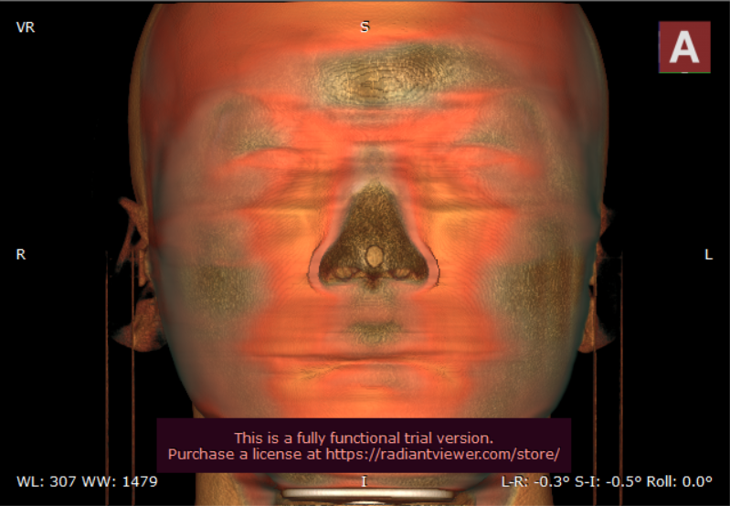

# Facial-De-identification-in-Head-CT-scans
Algorithm using image processing techniques

### Algorithm 
Applied Gaussian blurring on skin pixels to get results as shown:  
#### Actual Scan:
  
#### After Blurring:
  
 
We get following results on 3D reconstruction:
#### Original Scan:
  
#### Result
  
